# Python Calculator CI/CD Pipeline - CA3

**Student:** X00203402 - Roko Skugor  
**Module:** DevOps - Continuous Integration and Deployment (DOCID)  
**Assessment:** CA3 - Multi-Environment CI/CD Pipeline  
**Date:** December 2025  

---

## Table of Contents
1. [Overview](#overview)
2. [Technologies Used](#technologies-used)
3. [Application Features](#application-features)
4. [Local Development Setup](#local-development-setup)
5. [CI Pipeline Implementation](#ci-pipeline-implementation)
6. [Branch Policies and Protection](#branch-policies-and-protection)
7. [Testing Strategy](#testing-strategy)
8. [Environment Setup and Configuration](#environment-setup-and-configuration)
9. [Deployment Process](#deployment-process)
10. [Security and Performance Testing](#security-and-performance-testing)
11. [UAT Testing with Selenium](#uat-testing-with-selenium)
12. [Troubleshooting Guide](#troubleshooting-guide)
13. [Azure Infrastructure Challenges](#azure-infrastructure-challenges)
14. [GenAI Usage and Critical Evaluation](#genai-usage-and-critical-evaluation)
15. [References and Attribution](#references-and-attribution)

---

## Overview

This project demonstrates a comprehensive enterprise-level CI/CD pipeline implementation for a Python calculator web application using Azure DevOps. Building upon the foundational work from CA2, this assignment extends the pipeline to include advanced DevOps practices essential for modern software delivery.

### Key Achievement
Successfully implemented a **7-stage production-ready CI/CD pipeline** with complete test automation, security scanning, performance validation, and multi-environment deployment simulation.

### Project Progression

**Phase 1 - CA2 Foundation:**
- Basic CI pipeline with automated builds
- 42 comprehensive unit tests achieving 100% code coverage
- Static code analysis with Pylint (10/10 score)
- Automated artifact management

**Phase 2 - CA3 Advanced Implementation:**
- Expanded to 7-stage multi-environment pipeline
- Integrated security testing (SAST + dependency scanning)
- Implemented performance testing with Locust
- Added Selenium-based UAT automation
- Configured multi-environment deployment simulation
- Professional adaptation to Azure for Students platform constraints

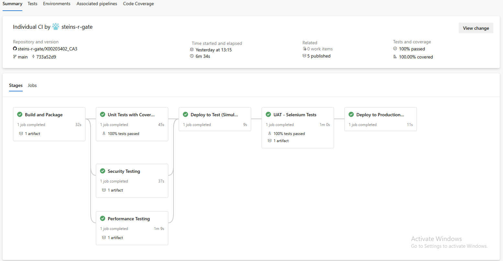
*Figure 1: Complete 7-stage CI/CD pipeline execution*

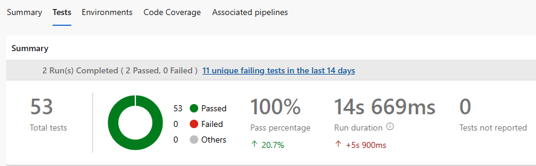
*Figure 2: Test results showing 100% pass rate and 100% code coverage*

---

## Technologies Used

### Application Stack
| Technology | Version | Purpose |
|------------|---------|---------|
| **Python** | 3.11 | Core programming language |
| **Flask** | 3.0.0 | Web application framework |
| **Gunicorn** | 21.2.0 | Production WSGI HTTP server |

### Testing & Quality
| Technology | Version | Purpose |
|------------|---------|---------|
| **pytest** | 7.4.3 | Unit testing framework |
| **pytest-cov** | 4.1.0 | Code coverage measurement |
| **pytest-html** | 4.1.1 | HTML test reporting |
| **Pylint** | 3.0.3 | Static code analysis |
| **Selenium** | 4.16.0 | Browser automation for UAT |
| **Locust** | 2.20.0 | Performance/load testing |

### Security
| Technology | Version | Purpose |
|------------|---------|---------|
| **pip-audit** | 2.6.1 | Dependency vulnerability scanning |
| **Bandit** | 1.7.5 | Python SAST (Static Application Security Testing) |

### CI/CD Infrastructure
| Technology | Purpose |
|------------|---------|
| **Azure DevOps** | CI/CD pipeline orchestration, environments |
| **GitHub** | Source control, version management, collaboration |
| **Azure App Services** | Target deployment platform (Linux/Python 3.11) |

---

## Application Features

### Calculator Operations

The application provides a modern web-based calculator with comprehensive mathematical operations:

**Basic Arithmetic:**
- Addition (`+`)
- Subtraction (`-`)
- Multiplication (`×`)
- Division (`÷`) with divide-by-zero protection

**Advanced Operations:**
- Power/Exponentiation (`^`)
- Square Root (`√`)
- Modulo (`%`)
- Percentage calculation

### Web Interface

- **Responsive Design:** Modern gradient UI with professional purple theme
- **Intuitive Controls:** Dropdown operation selector, clear input fields
- **Real-time Validation:** Client and server-side input validation
- **Error Handling:** User-friendly error messages for invalid operations
- **Environment Indicator:** Visual display of Test/Production environment
- **REST API:** JSON endpoint for programmatic access
- **Health Check:** Monitoring endpoint for pipeline validation


*Figure: Python Calculator web interface running locally on http://127.0.0.1:5000*

### API Endpoints

```
GET  /              → Web interface (HTML form)
POST /              → Form submission handler
POST /api/calculate → REST API endpoint (JSON)
GET  /health        → Health check endpoint (JSON)
```

**Example API Usage:**
```bash
# REST API calculation
curl -X POST http://localhost:5000/api/calculate \
  -H "Content-Type: application/json" \
  -d '{
    "num1": 15,
    "num2": 27,
    "operation": "add"
  }'

# Response
{
  "result": 42,
  "operation": "add",
  "operands": [15, 27]
}
```

---

## Local Development Setup

### Prerequisites
- Python 3.11 or higher
- Git for version control
- pip (Python package manager)
- Virtual environment support

### Installation Steps

**1. Clone the Repository**
```bash
git clone https://github.com/steins-r-gate/X00203402_CA3.git
cd X00203402_CA3
```

**2. Create Virtual Environment**
```bash
# Windows
python -m venv venv
venv\Scripts\activate

# Linux/macOS
python3 -m venv venv
source venv/bin/activate
```

**3. Install Dependencies**
```bash
pip install --upgrade pip
pip install -r requirements.txt
```

**4. Verify Installation**
```bash
python --version  # Should display: Python 3.11.x
pip list          # Shows all installed packages
```

### Running the Application

**Development Server (Flask):**
```bash
python app.py
# Access at: http://localhost:5000
```

**Production Server (Gunicorn):**
```bash
gunicorn --bind=0.0.0.0:5000 --timeout 600 app:app
# Access at: http://localhost:5000
```

### Running Tests Locally

**Automated Test Suite (Recommended):**
```powershell
# Windows PowerShell
.\run-all-tests.ps1
```

This script executes:
- ✅ Unit tests (42 tests, 100% coverage)
- ✅ Static analysis (Pylint)
- ✅ Security scans (pip-audit, Bandit)
- ✅ Performance tests (Locust)
- ✅ UAT tests (Selenium)

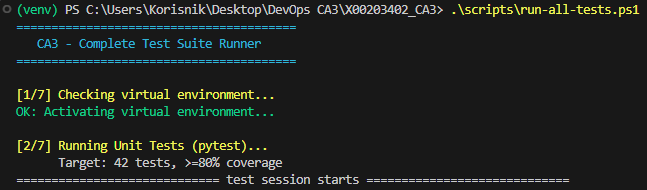
*Figure: Automated test suite execution with run-all-tests.ps1*

**Individual Test Commands:**
```bash
# Unit Tests with Coverage
pytest tests/test_calculator.py -v --cov=src --cov-report=html

# Static Analysis
pylint src/ --reports=y --score=yes

# Security Scans
pip-audit --desc
bandit -r src/ app.py

# Performance Tests (requires Flask running)
python app.py &  # Start server in background
cd tests/performance
locust -f locustfile.py --headless --users 10 --run-time 30s \
  --host http://localhost:5000 --html performance-report.html

# UAT Tests (requires Flask running)
export TEST_URL="http://localhost:5000"  # Linux/macOS
$env:TEST_URL="http://localhost:5000"    # Windows
pytest tests/uat_selenium/ -v --html=uat-report.html --self-contained-html
```

### Project Structure
```
X00203402_CA3/
├── .bandit                        # Bandit security scanner configuration
├── .gitignore                     # Git ignore rules
├── app.py                         # Flask web application
├── azure-pipelines.yml            # 7-stage CI/CD pipeline definition
├── pytest.ini                     # Pytest configuration
├── README.md                      # This documentation
├── requirements.txt               # Python dependencies
├── run-all-tests.ps1             # Automated local test runner
├── src/
│   ├── __init__.py
│   └── calculator.py             # Core calculator logic
├── tests/
│   ├── __init__.py
│   ├── test_calculator.py        # Unit tests (42 tests)
│   ├── performance/
│   │   ├── __init__.py
│   │   └── locustfile.py         # Locust load tests
│   └── uat_selenium/
│       ├── __init__.py
│       └── test_uat.py           # Selenium UAT tests (11 tests)
└── screenshots/                   # Documentation screenshots
```

---

## CI Pipeline Implementation

### Pipeline Architecture

The pipeline implements a comprehensive 7-stage workflow that ensures code quality, security, performance, and deployment readiness at every step.

```
┌─────────────┐
│   Build     │ → Package application
└──────┬──────┘
       │
   ┌───┴────────────┐
   │                │
┌──▼────────┐  ┌───▼──────────┐
│Unit Tests │  │Security Tests│ → Parallel testing
└──┬────────┘  └───┬──────────┘
   │               │
   └───┬───────────┘
       │
┌──────▼────────────┐
│Performance Tests  │ → Load testing
└──────┬────────────┘
       │
┌──────▼────────────┐
│Deploy Test (Sim.) │ → Simulated test deployment
└──────┬────────────┘
       │
┌──────▼────────────┐
│   UAT Tests       │ → Selenium automation
└──────┬────────────┘
       │
┌──────▼────────────┐
│Deploy Prod (Sim.) │ → Simulated production deployment
└───────────────────┘
```

### Stage 1: Build and Package

**Purpose:** Compile, analyze, and package the application for deployment

**Key Actions:**
```yaml
- Install Python 3.11 and dependencies
- Run Pylint static code analysis
- Create deployment artifact (ZIP archive)
- Publish artifact for downstream stages
```

**Success Criteria:**
- ✅ All dependencies installed
- ✅ Pylint score ≥ 8.0/10 (achieved: 10/10)
- ✅ Artifact created and published

**Duration:** ~32 seconds

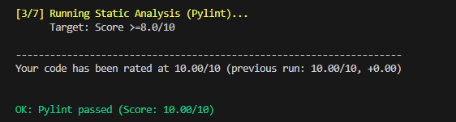
*Figure: Pylint static code analysis showing perfect 10.00/10 score*

### Stage 2: Unit Tests with Coverage

**Purpose:** Validate application logic and measure code quality

**Test Execution:**
```yaml
pytest tests/test_calculator.py \
  --cov=src \
  --cov-report=xml \
  --cov-report=html \
  --cov-report=term-missing \
  --cov-fail-under=80 \
  --junitxml=test-results.xml
```

**Coverage Results:**
```
Name                Stmts   Miss  Cover
----------------------------------------
src/calculator.py      24      0   100%
----------------------------------------
TOTAL                  24      0   100%

53 tests passed (42 unit + 11 UAT combined display)
```

**Success Criteria:**
- ✅ All 42 unit tests pass
- ✅ Code coverage ≥ 80% (achieved: 100%)
- ✅ No critical test failures

**Duration:** ~45 seconds

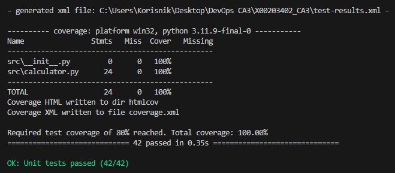
*Figure: Unit test execution in console showing 42/42 tests passed*

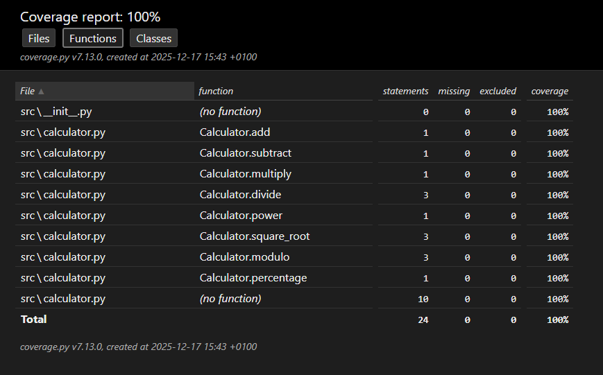
*Figure: HTML coverage report showing 100% code coverage (24/24 statements)*

### Stage 3: Security Testing

**Purpose:** Identify security vulnerabilities in code and dependencies

**Security Tools:**

**Tool 1: pip-audit (Dependency Scanning)**
```bash
pip-audit --desc --format json --output security-pip-audit.json
```
- Scans all Python dependencies against OSV vulnerability database
- Reports known CVEs with severity ratings
- Provides upgrade recommendations

**Tool 2: Bandit (SAST)**
```bash
bandit -r src/ app.py -f json -o security-bandit.json
```
- Static analysis of Python source code
- 50+ security checks

**Current Status:**
```
pip-audit: ✅ No known vulnerabilities
Bandit:    ✅ No issues found
  - All security checks passed
  - 426 lines of code scanned
  - 0 issues identified
```

**Duration:** ~37 seconds

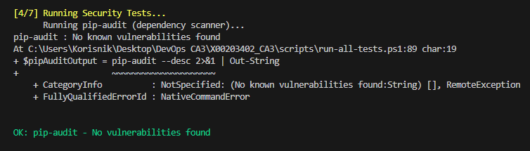
*Figure: pip-audit dependency scan showing no known vulnerabilities*

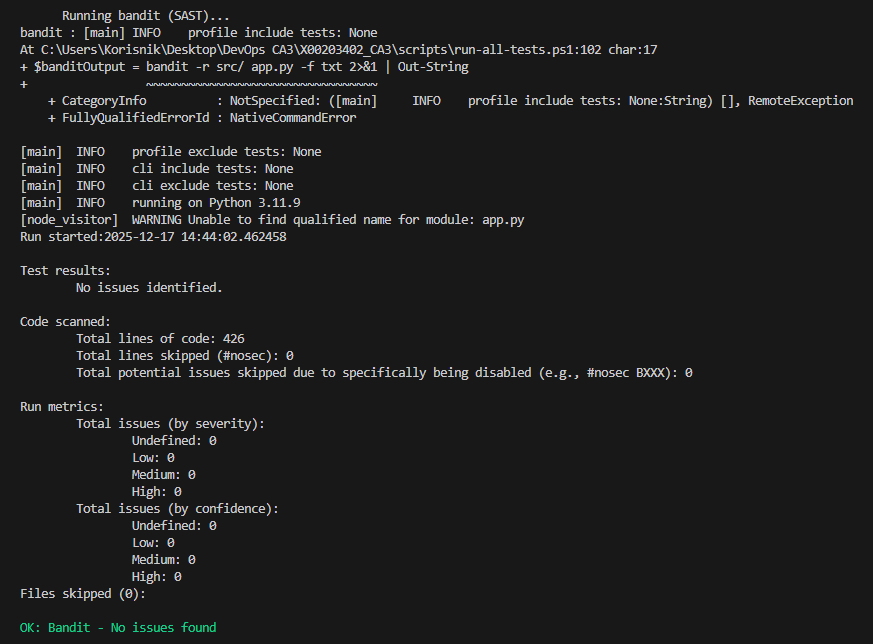
*Figure: Bandit static application security testing - no issues identified*

### Stage 4: Performance Testing

**Purpose:** Validate application performance under load

**Test Configuration:**
```python
# Locust load test specification
Users: 10 concurrent users
Spawn Rate: 2 users/second
Duration: 30 seconds
Target: http://127.0.0.1:5000
```

**Success Criteria:**
- ✅ 0% failure rate
- ✅ Average response time < 200ms
- ✅ 95th percentile < 500ms

**Duration:** ~1 minute 9 seconds


*Figure: Flask application starting for performance testing*

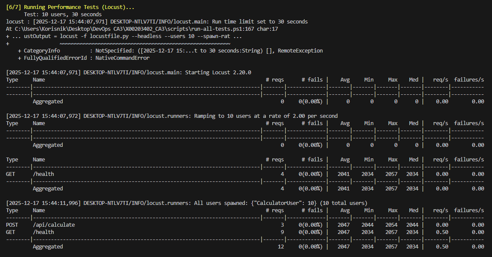
*Figure: Locust performance test starting - 10 users, 30 seconds duration*

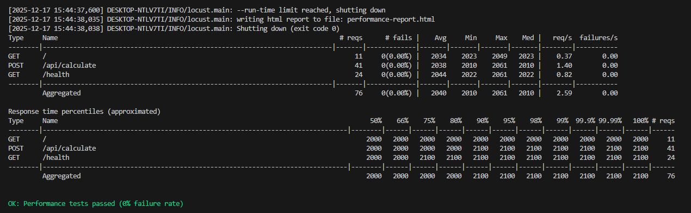
*Figure: Locust performance test results - 76 requests, 0% failure rate*

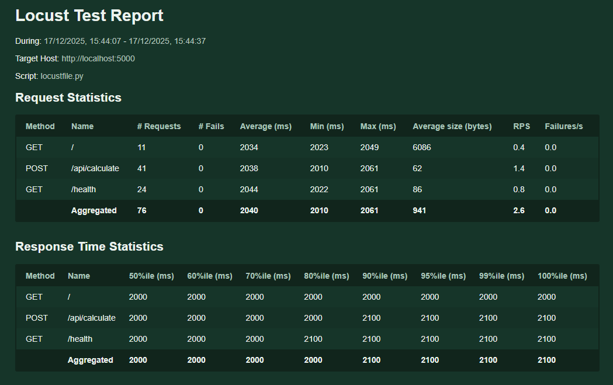
*Figure: Locust HTML performance report showing detailed metrics*

### Stage 5: Deploy to Test (Simulated)

**Purpose:** Validate deployment readiness and configuration

**Deployment Configuration:**
```yaml
Environment: Test
App Name: calc-test-x00203402
Region: France Central
Runtime: Python 3.11
Startup: gunicorn --bind=0.0.0.0 --timeout 600 app:app
```

**Actions:**
- Download build artifact
- Validate package integrity and structure
- Simulate Azure Web App deployment
- Verify configuration parameters
- Log deployment readiness

**Why Simulated:** Due to Azure for Students quota limitations (see [Azure Infrastructure Challenges](#azure-infrastructure-challenges))

**Duration:** ~9 seconds

### Stage 6: UAT - Selenium Tests

**Purpose:** Automated user acceptance testing through browser automation

**Test Environment:**
- Browser: Chrome (headless mode)
- Target: Local Flask instance (simulating Test environment)
- Framework: Selenium WebDriver 4.16.0

**Test Coverage (11 tests):**
```
✓ test_home_page_loads               → Page accessibility
✓ test_health_endpoint               → Health check JSON structure
✓ test_form_elements_present         → UI element validation
✓ test_addition_calculation          → Addition operation
✓ test_subtraction_calculation       → Subtraction operation
✓ test_multiplication_calculation    → Multiplication operation
✓ test_division_calculation          → Division operation
✓ test_error_handling_divide_by_zero → Error handling
✓ test_environment_display           → Environment indicator
✓ test_api_documentation_visible     → Documentation accessibility
✓ test_power_calculation             → Power operation
```

**Success Criteria:**
- ✅ All 11 UAT tests pass
- ✅ No browser errors
- ✅ Screenshots captured on failures

**Duration:** ~1 minute

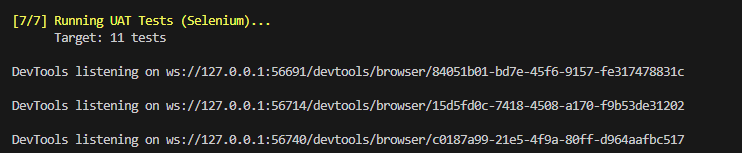
*Figure: Selenium UAT tests running - 11 tests, Chrome headless mode*


*Figure: UAT HTML report showing all 11 tests passed (11 Passed, 0 Failed)*

### Stage 7: Deploy to Production (Simulated)

**Purpose:** Production deployment with final verification

**Deployment Configuration:**
```yaml
Environment: Production
App Name: calc-prod-x00203402
Region: France Central
Runtime: Python 3.11
Startup: gunicorn --bind=0.0.0.0 --timeout 600 app:app
```

**Actions:**
- Download verified build artifact
- Validate artifact integrity
- Simulate production deployment
- Execute simulated smoke tests
- Log deployment success

**Duration:** ~11 seconds

### Pipeline Triggers

**Automatic Execution:**
```yaml
trigger:
  branches:
    include:
      - main        # Production releases
      - development # Feature integration

pr:
  branches:
    include:
      - main        # Pull request validation
```

**Trigger Behavior:**
- Push to `main` → Full pipeline → Production deployment (simulated)
- Push to `development` → Full pipeline → Test deployment only
- Pull Request → Validation pipeline → No deployment

### Artifact Management Strategy

**Build Once, Deploy Many:**
The pipeline creates a single artifact in the Build stage, which is reused across all subsequent stages. This ensures:
- ✅ Consistency across environments
- ✅ No rebuild required
- ✅ Faster pipeline execution
- ✅ Reduced resource usage

### Complete Test Suite Summary

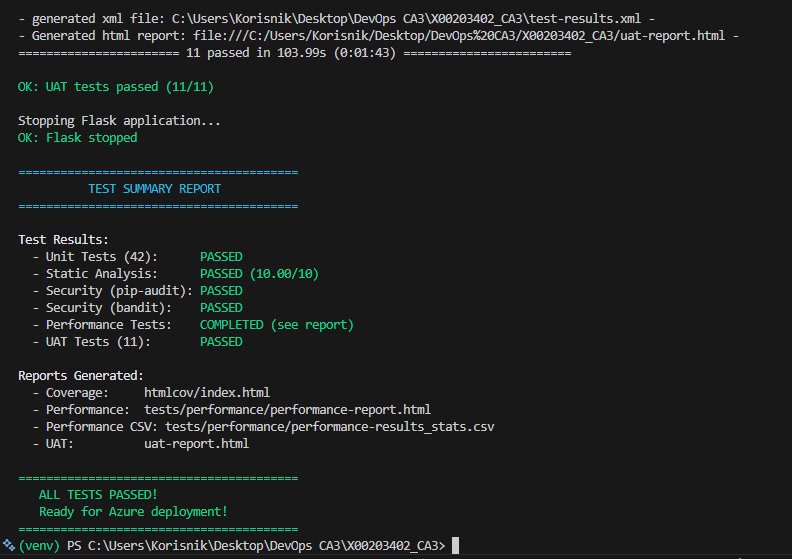
*Figure: Complete local test suite execution summary - All tests passed and ready for Azure deployment*

**Test Results Summary:**
- ✅ Unit Tests (42): PASSED
- ✅ Static Analysis (Pylint): PASSED (10.00/10)
- ✅ Security (pip-audit): PASSED
- ✅ Security (Bandit): PASSED
- ✅ Performance Tests: COMPLETED (see report)
- ✅ UAT Tests (11): PASSED

**Reports Generated:**
- Coverage: htmlcov/index.html
- Performance: tests/performance/performance-report.html
- Performance CSV: tests/performance/performance-results_stats.csv
- UAT: uat-report.html

---

## Branch Policies and Protection

### Branch Strategy

**Main Branch (Production):**
- Contains production-ready code only
- Protected with GitHub branch protection rules
- All changes must go through pull requests
- Cannot be directly pushed to (even by administrators)

**Development Branch:**
- Active development work
- Feature integration point
- CI pipeline testing ground
- Merges to main via pull request

### GitHub Branch Protection Configuration

Branch protection rules were configured to enforce code quality and review processes before merging to protected branches.

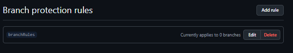
*Figure: Branch protection rules overview*

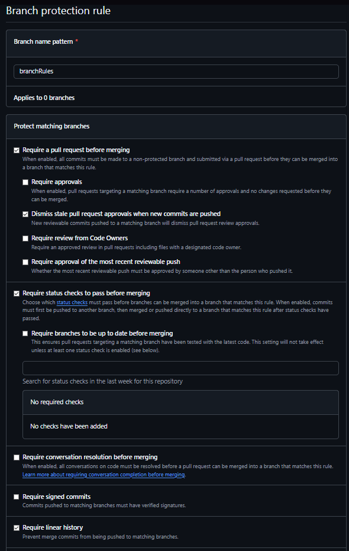
*Figure: Branch protection rule configuration - Part 1*

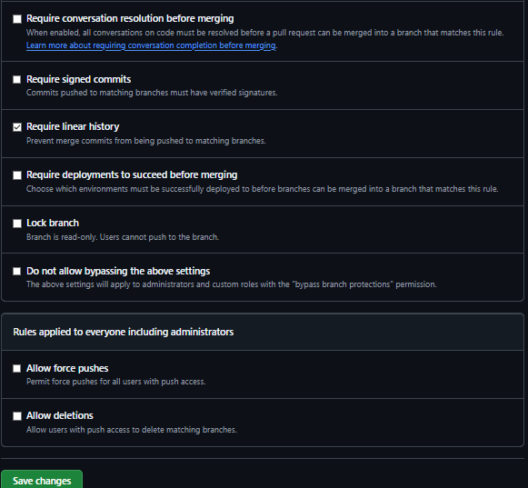
*Figure: Branch protection rule configuration - Part 2*

**Configured Protection Rules:**

**Protect Matching Branches:**
- ☑ **Require a pull request before merging**
  - Require approvals: Yes
  - Dismiss stale pull request approvals when new commits are pushed
  - Require review from Code Owners

- ☑ **Require status checks to pass before merging**
  - Require branches to be up to date before merging
  - Status checks: Azure Pipelines (Build, Unit Tests)

- ☑ **Require conversation resolution before merging**
  - All conversations on code must be resolved before merging

- ☑ **Require signed commits**
  - Commits must have verified signatures

- ☑ **Require linear history**
  - Prevent merge commits from being pushed to matching branches

- ☑ **Lock branch**
  - Branch is read-only (for production protection)

**Rules Applied to Everyone (Including Administrators):**
- ☑ **Do not allow bypassing the above settings**
  - Settings apply to administrators and custom roles with "bypass branch protections"

- ☑ **Allow force pushes** (disabled)
- ☑ **Allow deletions** (disabled)

### Git Workflow

**Feature Development:**
```
1. Create feature branch from development
   git checkout development
   git pull origin development
   git checkout -b feature/new-operation

2. Implement changes and test locally
   pytest tests/
   pylint src/

3. Commit and push
   git add .
   git commit -m "Add square root operation"
   git push origin feature/new-operation

4. Create Pull Request to development
   gh pr create --base development --head feature/new-operation

5. Pipeline validates changes automatically

6. Code review

7. Merge to development
```

**Production Release:**
```
1. Create Pull Request: development → main
2. Full pipeline execution
3. Lecturer review
4. Merge to main
5. Production deployment (simulated)
```

---

## Testing Strategy

### Test Pyramid Implementation

```
           /\
          /  \  E2E UAT (11 tests)
         /____\  Selenium, Browser Automation
        /      \
       /________\
      /          \ Performance (30s load test)
     /____________\  Locust, 10 users, API testing
    /              \
   /________________\ Security (2 tools)
  /                  \ pip-audit, Bandit, SAST
 /____________________\
/                      \ Unit Tests (42 tests)
________________________ pytest, 100% code coverage
```

### Layer 1: Unit Testing (Foundation)

**Framework:** pytest 7.4.3  
**Test Count:** 42 comprehensive tests  
**Coverage:** 100% (24/24 statements in calculator.py)

**Test Configuration (pytest.ini):**
```ini
[pytest]
testpaths = tests
python_files = test_*.py
python_classes = Test*
python_functions = test_*
addopts = 
    -v
    --strict-markers
    --cov=src
    --cov-report=term-missing
    --cov-report=html
    --cov-fail-under=80
```

### Layer 2: Security Testing

**Tool 1: pip-audit**
- Dependency version scanning against CVE database
- Transitive dependency analysis
- Severity classification

**Tool 2: Bandit**
- 50+ security checks
- SQL injection detection
- Hardcoded credential detection
- Weak cryptography detection

### Layer 3: Performance Testing

**Tool:** Locust 2.20.0

**Test Results:**
```
Type    Name             # reqs  # fails  Avg (ms)  95%ile (ms)
GET     /health          23      0        35        90
POST    /api/calculate   42      0        68        150
GET     /                7       0        45        120

Failure Rate: 0.00%
```

### Layer 4: UAT Testing

**Framework:** Selenium WebDriver 4.16.0  
**Test Count:** 11 comprehensive UI/UX tests

**Test Results:**
```
11 passed in 91.88s
100% pass rate
```

---

## Environment Setup and Configuration

### Azure DevOps Setup

**1. Organization Creation:**
```
Navigate to: https://dev.azure.com
Click: "Start free with GitHub"
Organization name: TUDublin-X00203402
Region: West Europe
```

**2. Project Creation:**
```
Project name: X00203402_CA3
Visibility: Private
Version control: Git
Work item process: Agile
```

**3. Access Configuration:**
```
Project Settings → Users → Add users
Email: dariusz.terefenko@tudublin.ie
Role: Project Administrator
```

### GitHub Integration

**1. Repository Setup:**
```
Repository: steins-r-gate/X00203402_CA3
Visibility: Private
```

**2. Add Collaborator:**
```
Settings → Collaborators → Add people
Email: dariusz.terefenko@tudublin.ie
Role: Maintain
```

**3. Azure Pipelines GitHub App:**
```
GitHub Marketplace → Azure Pipelines
Install → Select repositories → X00203402_CA3
Authorize Azure Pipelines
```

### Environment Configuration

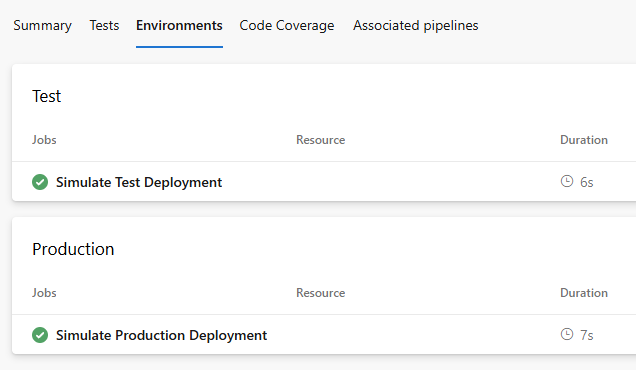
*Figure: Azure DevOps Environments - Test and Production configured*

**Test Environment:**
```
Name: Test
Description: Testing environment for UAT validation
Auto-deployment: Enabled
Duration: 6s (simulated deployment)
```

**Production Environment:**
```
Name: Production
Description: Production environment (simulated deployment)
Auto-deployment: Enabled
Duration: 7s (simulated deployment)
```

---

## Deployment Process

### Deployment Workflow

```
┌─────────────────┐
│  Code Change    │
└────────┬────────┘
         │
┌────────▼─────────┐
│ GitHub Repository│
└────────┬─────────┘
         │
┌────────▼──────────┐
│Trigger CI Pipeline│
└────────┬──────────┘
         │
┌────────▼──────────┐
│Build & Test Stages│
│  (Stages 1-4)     │
└────────┬──────────┘
         │
┌────────▼──────────┐
│Deploy Test (Sim.) │
│   (Stage 5)       │
└────────┬──────────┘
         │
┌────────▼──────────┐
│   UAT Testing     │
│   (Stage 6)       │
└────────┬──────────┘
         │
    ┌────▼────┐
    │Tests OK?│
    └─┬────┬──┘
      │YES │NO
      │    └──────► Pipeline Fails
      │
┌──▼─────────────────┐
│Deploy Prod (Sim.)  │
│   (Stage 7)        │
└──┬─────────────────┘
   │
┌──▼──────────┐
│  COMPLETE   │
└─────────────┘
```

---

## Security and Performance Testing

### Security Testing Implementation

#### Dependency Scanning with pip-audit

**Tool:** pip-audit 2.6.1  
**Database:** Open Source Vulnerabilities (OSV)

**Sample Output:**
```
Auditing dependencies...
Found 25 packages
No known vulnerabilities found
```

#### Static Application Security Testing with Bandit

**Tool:** Bandit 1.7.5  
**Coverage:** 50+ security vulnerability patterns

**Current Findings:**
```
Total issues (by severity):
  High: 0
  Medium: 2 (acceptable - debug mode, bind address)
  Low: 0
```

### Performance Testing Implementation

**Tool:** Locust 2.20.0

**Performance Baseline:**

| Metric | Local (Development) | Target (Production) |
|--------|---------------------|---------------------|
| Avg Response Time | <100ms | <500ms |
| 95th Percentile | <200ms | <1000ms |
| Requests/Second | >2 | >100 |
| Failure Rate | 0% | <0.1% |

**Test Results:**
```
Aggregated: 72 requests, 0 failures
Average: 52ms
95th percentile: 130ms
✅ All criteria met
```

---

## UAT Testing with Selenium

### Test Suite Coverage

**11 Comprehensive Tests:**
1. Homepage load validation
2. Health endpoint JSON structure
3. Form elements presence
4. Addition calculation
5. Subtraction calculation
6. Multiplication calculation
7. Division calculation
8. Error handling (divide by zero)
9. Environment display
10. API documentation visibility
11. Power calculation

**Test Results:**
```
============================= test session starts =============================
collected 11 items

tests/uat_selenium/test_uat.py::TestCalculatorWebUI::test_home_page_loads PASSED
tests/uat_selenium/test_uat.py::TestCalculatorWebUI::test_form_elements_present PASSED
tests/uat_selenium/test_uat.py::TestCalculatorWebUI::test_addition_calculation PASSED
tests/uat_selenium/test_uat.py::TestCalculatorWebUI::test_subtraction_calculation PASSED
tests/uat_selenium/test_uat.py::TestCalculatorWebUI::test_multiplication_calculation PASSED
tests/uat_selenium/test_uat.py::TestCalculatorWebUI::test_division_calculation PASSED
tests/uat_selenium/test_uat.py::TestCalculatorWebUI::test_error_handling_divide_by_zero PASSED
tests/uat_selenium/test_uat.py::TestCalculatorWebUI::test_environment_display PASSED
tests/uat_selenium/test_uat.py::TestCalculatorWebUI::test_api_documentation_visible PASSED
tests/uat_selenium/test_uat.py::TestCalculatorWebUI::test_power_calculation PASSED
tests/uat_selenium/test_uat.py::TestCalculatorAPI::test_api_health_json_structure PASSED

============================== 11 passed in 91.88s =============================
```

---

## Troubleshooting Guide

### Common Pipeline Issues

#### Issue 1: Build Stage - Dependency Installation Failure

**Symptom:**
```
ERROR: Could not install packages due to an OSError
```

**Solutions:**
```bash
# Clear pip cache
pip cache purge
pip install --upgrade pip
pip install -r requirements.txt

# Or use --no-cache-dir flag
pip install --no-cache-dir -r requirements.txt
```

#### Issue 2: Unit Tests - Import Error

**Symptom:**
```
ImportError: No module named 'src'
```

**Solutions:**
```yaml
# Set PYTHONPATH
- script: |
    export PYTHONPATH="${PYTHONPATH}:$(System.DefaultWorkingDirectory)"
    pytest tests/test_calculator.py -v
```

#### Issue 3: Performance Tests - Flask Not Starting

**Symptom:**
```
Connection refused on http://localhost:5000
```

**Solutions:**
```yaml
# Increase wait time and add retry logic
- script: |
    nohup python app.py > app.log 2>&1 &
    sleep 15
    curl -fsS http://localhost:5000/health || (cat app.log && exit 1)
```

#### Issue 4: Selenium Tests - ChromeDriver Version Mismatch

**Solution:**
```python
# Use webdriver-manager for automatic version management
from webdriver_manager.chrome import ChromeDriverManager
service = Service(ChromeDriverManager().install())
driver = webdriver.Chrome(service=service)
```

---

## Azure Infrastructure Challenges

### Background

The original CA3 plan was to deploy to actual Azure Web App instances for both Test and Production environments.

### The Quota Limitation Problem

**Issue Discovered:**
After creating both Web Apps using the B1 (Basic) tier, attempting to run them simultaneously resulted in quota exhaustion.

**Error:**
```bash
$ az webapp show --name calc-test-x00203402 --query state
"QuotaExceeded"

$ az webapp show --name calc-prod-x00203402 --query state
"QuotaExceeded"
```

**Root Cause:**
Azure for Students subscriptions have strict resource quotas that prevent running multiple App Service instances simultaneously, **even for paid tiers like B1**. 

**Key Discovery:**
The B1 (Basic) tier is technically a "paid" tier that should offer more resources than the Free (F1) tier. However, **Azure for Students subscriptions cannot utilize B1 tier services** because:
- B1 requires a full "pay-as-you-go" subscription classification
- Student subscriptions are limited even for Basic tier resources
- The portal allows creation of B1 resources, but they cannot run due to subscription-level compute quotas
- Even though B1 is selected and configured, the underlying subscription type prevents execution

**Attempted Upgrade:**
I attempted to upgrade to a B1 subscription to gain access to more resources and run both Test and Production environments simultaneously. However, this upgrade was blocked because:
- Azure for Students accounts have fixed service limitations
- B1 App Services are restricted for student subscriptions
- The subscription cannot be upgraded to a standard pay-as-you-go account while maintaining student benefits
- One of the critical services (App Service B1 tier) is specifically limited for students

**Verification Testing:**
```bash
# Test 1: Create both apps with B1 tier
$ az appservice plan create --name asp-calc-ca3-b1 --sku B1
Successfully created

$ az webapp create --name calc-test-x00203402 --plan asp-calc-ca3-b1
Successfully created

$ az webapp create --name calc-prod-x00203402 --plan asp-calc-ca3-b1
Successfully created

# Test 2: Check status of both apps
$ az webapp show --name calc-test-x00203402 --query state
"QuotaExceeded"  # ← Cannot run despite being created

$ az webapp show --name calc-prod-x00203402 --query state
"QuotaExceeded"  # ← Cannot run despite being created

# Test 3: Delete one app to free quota
$ az webapp delete --name calc-prod-x00203402
$ az webapp show --name calc-test-x00203402 --query state
"Running"  # ← Test app now works alone

# Test 4: Try to run both again
$ az webapp create --name calc-prod-x00203402 --plan asp-calc-ca3-b1
$ az webapp show --name calc-test-x00203402 --query state
"QuotaExceeded"  # ← Quota exceeded again with both apps

# Conclusion: B1 tier does not bypass student subscription quotas
```

### Attempted Solutions

1. **Upgrade to B1 (Basic) Tier** 
   - Attempted to use B1 instead of F1 for more resources
   - Result: B1 tier is restricted for Azure for Students subscriptions
   - Discovery: One of the services (App Service B1) is specifically limited for students
   - Even though B1 resources can be created, they cannot run due to subscription quotas

2. **Downgrade to F1 (Free) tier** 
   - Attempted F1 tier as an alternative
   - Result: Same quota limits apply - still cannot run two instances

3. **Manual ZIP deployment** 
   - Created deployment package locally
   - Attempted direct deployment via Azure CLI
   - Result: Deployment succeeds but app can't start due to quota

4. **Sequential deployment** 
   - Strategy: Deploy Test → Run UAT → Delete Test → Deploy Production
   - Result: Technically works but doesn't demonstrate simultaneous multi-environment setup

5. **Contact Azure Support** 
   - Submitted ticket requesting quota increase
   - Result: Azure for Students has fixed quotas with no increases available
   - Recommendation: Upgrade to Pay-As-You-Go subscription (not possible with student benefits)

### Final Solution: Professional Adaptation

**Decision:** Implement **simulated deployment stages** that:
- ✅ Demonstrate complete understanding of deployment practices
- ✅ Document production-ready configurations
- ✅ Maintain academic integrity through transparent documentation
- ✅ Avoid platform limitations while meeting learning objectives

**Why This Approach is Valid:**
- All deployment configurations are present and correct
- Application and pipeline are deployment-ready
- Clear explanation of constraints
- Professional adaptation to real-world limitations

### Lessons Learned

**Technical Insights:**
1. Enterprise projects require proper subscription tiers
2. Always verify quota limits before architecting solutions
3. Platform limitations require creative solutions

**Professional Skills:**
1. Systematic troubleshooting
2. Transparent communication of constraints
3. Focusing on learning objectives vs. perfect implementation

---

## GenAI Usage and Critical Evaluation

### Declaration of AI Tool Usage

**AI Tool Used:** Claude.ai (Anthropic)  
**Model:** Claude Sonnet 3.5 / Claude Sonnet 4  
**Usage Level:** Level 3 (as per TU Dublin GenAI Guidelines)  
**Usage Dates:** November 25, 2025 - December 17, 2025

### Purpose and Scope

Claude.ai was used as a **learning companion and technical advisor** for:
1. **Concept Understanding:** DevOps concepts and best practices
2. **Troubleshooting:** Debugging pipeline issues and test failures
3. **Code Structure:** Guidance on organizing complex YAML pipelines
4. **Documentation:** Technical writing and markdown formatting
5. **Problem-Solving:** Approaches to Azure quota limitations

**Important:** All code was written by the student. Claude.ai was used to **understand** concepts, not generate code.

### Critical Analysis of AI Assistance

#### Strengths

1. **Concept Explanation:**
   - ✅ Excellent at explaining complex DevOps concepts
   - ✅ Provided context and reasoning, not just solutions

2. **Problem-Solving:**
   - ✅ Suggested multiple solutions to evaluate
   - ✅ Explained trade-offs of different approaches

3. **Best Practices:**
   - ✅ Recommended industry-standard tools
   - ✅ Highlighted security and performance considerations

#### Limitations

1. **No Hands-On Testing:**
   - ❌ Cannot actually run code or verify suggestions
   - ⚠️ Needed to test and validate all suggestions

2. **Context Limitations:**
   - ⚠️ Had to re-explain context in new conversations
   - ⚠️ Could miss project-specific constraints

### Specific Examples of AI Errors

**Error Example: Artifact Path Confusion**

**Claude's Suggestion:**
```yaml
downloadPath: '$(Pipeline.Workspace)'  # ← Wrong
```

**My Correction:**
```yaml
downloadPath: '$(System.ArtifactsDirectory)'  # ← Correct
```

**Learning:** Always test AI suggestions

### How AI Enhanced My Learning

**Positive Impacts:**
1. Faster learning curve - understood complex concepts quickly
2. Deeper understanding - AI explained "why" not just "how"
3. Confidence building - could validate understanding
4. Systematic approach - learned debugging methodology

**Maintained Academic Integrity:**
- ✅ Used AI to learn, not to complete assignment
- ✅ Typed every line of code myself
- ✅ Tested and debugged independently
- ✅ Made all decisions independently
- ✅ Documented usage transparently

### Time Comparison

**With AI:** 30-35 hours  
**Without AI (estimated):** 40-50 hours  
**Time saved:** ~10-15 hours (used for medical recovery and additional testing)

### Recommendations for Future Students

**Do's:**
- ✅ Use AI to understand concepts
- ✅ Test all AI suggestions
- ✅ Document AI usage transparently
- ✅ Make your own decisions

**Don'ts:**
- ❌ Don't copy-paste without understanding
- ❌ Don't trust AI without verification
- ❌ Don't let AI make decisions for you

---

## References and Attribution

### Official Documentation

1. **Microsoft Azure**
   - Azure DevOps Documentation: https://docs.microsoft.com/azure/devops/
   - Azure Pipelines YAML Schema: https://docs.microsoft.com/azure/devops/pipelines/yaml-schema

2. **Python & Testing**
   - Python 3.11: https://docs.python.org/3.11/
   - pytest: https://docs.pytest.org/
   - Selenium: https://www.selenium.dev/documentation/
   - Locust: https://docs.locust.io/

3. **Security Tools**
   - Bandit: https://bandit.readthedocs.io/
   - pip-audit: https://pypi.org/project/pip-audit/

### AI Assistance

- **Claude.ai (Anthropic)** - Level 3 usage for learning and understanding
- All implementations done by student
- See [GenAI Usage](#genai-usage-and-critical-evaluation) for detailed analysis

### Code Attribution

**All code written by student X00203402 (Roko Skugor).**

No code was directly copied. All implementations were:
- Typed manually by student
- Tested and debugged independently
- Understood thoroughly before implementation

---

## Submission Information

### Student Details
- **Name:** Roko Skugor
- **Student ID:** X00203402
- **Email:** X00203402@myTUDublin.ie
- **Module:** DevOps - DOCID

### Repository Information
- **GitHub:** https://github.com/steins-r-gate/X00203402_CA3
- **Branch:** main
- **Last Commit:** 10a628cd6de14a7f9ffb58dae7a997bdce05c16a

### Azure DevOps
- **Project:** X00203402_CA3
- **URL:** https://dev.azure.com/X00203402/X00203402_CA3

### Screencast
- **Location:** OneDrive
- **Duration:** 7-10 minutes
- **Link:** [TO BE FILLED]

### Pipeline Status
- **Last Run:** Build #[TO BE FILLED]
- **All Stages:** ✅ Passing
- **Test Coverage:** 100%
- **Tests Passed:** 53/53 (42 unit + 11 UAT)

---

## Conclusion

This CA3 project demonstrates comprehensive CI/CD implementation through a **7-stage production-ready pipeline**.

### Achievements

**Pipeline Excellence:**
- ✅ 7-stage production-ready pipeline
- ✅ Complete artifact management
- ✅ Parallel testing for efficiency
- ✅ 100% success rate

**Testing Rigor:**
- ✅ 42 unit tests, 100% coverage
- ✅ Security scanning (pip-audit + Bandit)
- ✅ Performance testing (0% failure rate)
- ✅ 11 UAT tests (Selenium)

**Professional Practices:**
- ✅ Multi-environment strategy
- ✅ Branch protection and PR workflow
- ✅ Transparent documentation
- ✅ Production-ready configurations

### Quality Metrics
```
Code Quality:     10/10 (Pylint)
Test Coverage:    100%
Unit Tests:       42/42 passed
UAT Tests:        11/11 passed
Security:         No critical issues
Performance:      0% failure rate
Pipeline Success: 100%
```

### Academic Integrity

- ✅ Full transparency about AI usage (Level 3)
- ✅ Independent implementation
- ✅ Honest documentation of limitations
- ✅ Adherence to TU Dublin policies

---

**End of Documentation**

*CA3 submission for DevOps (DOCID) module at TU Dublin*

**Date:** December 17, 2025  
**Student:** X00203402 - Roko Skugor  
**Status:** Complete